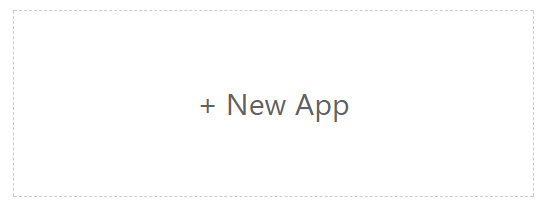
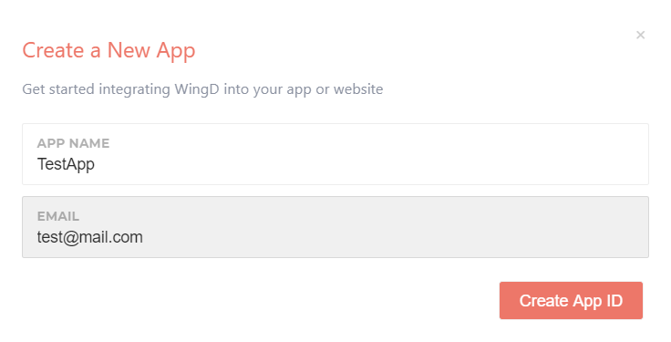
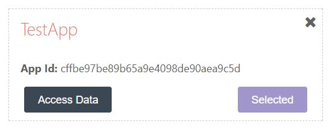
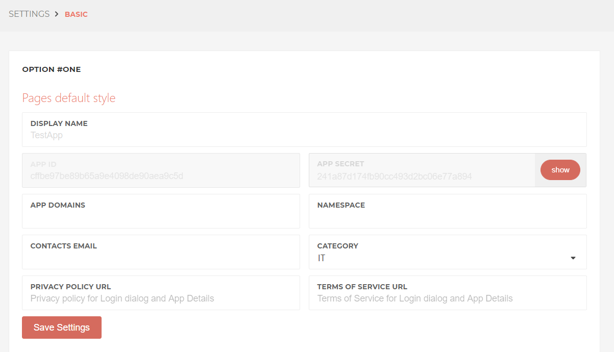

# Quick Start Guide

Developing a web application with the help of WingD can be done easily in three steps:

1. Register a new application

2. Download the libraries and create base code

3. Start coding

Lets see how you can do this magic!

## Step 1 - Register a new application

First of all, you need to have a **developer account**. Go to [api.wingd.co](https://api.wingd.co) and register either via your primary e-mail or by using your social media account.

*Lets create now a new app!*

At the dashboard click the **New App** button:



Enter a name for your app and the email you want to register with:



Click the **Create App ID** button to save your new app and then select it in order to view its configuration basic settings:



Go to the **Basic settings** pane and grab the ID and the secret key of the app since you will use them to configure your library:



**So far so good!**

## Step 2 - Download the libraries and create base code

All the required PHP libraries can be obtained via the public git repository.

Clone the library's code in your workspace:

```shell
git clone https://marjohn@bitbucket.org/WINGED-WARRIORS/dataaccessliabrary.git
```

Create the main class of your app and:

[x] import the two main required libraries

[x] configure your app with the App's **ID** and **Secret Key**

```php
# demoappp.php

<?php
require_once 'includes/WingDAuthAPI/php/WingDAuthAPI.php';
require_once 'includes/WingDDataAccessAPI/php/WingDDataAccessAPI.php';

/**
 * A primitive  Class of a demo application
 */
class DemoApp extends WingDdataAccessAPI
{

    function __construct() { parent::__construct(); }
}

$demo_app = new DemoApp();

// set the APP ID and Secret Key for example
$api_id         = "77e87f48d4d07466dfcd08b0e74b54ed";
$api_secret_key = "ce8363d63d3f1f36383ee96505b9f4dd";

// Authenticate with ID & Secret Key
$result = $demo_app->setAuth( $api_id, $api_secret_key);

// Check for authentication and retrieve the categories of the app
if( $demo_app->haveAuth() ){
  $result = $demo_app->getCategories();
} else {
  $result = "Please setAuth() before using access functions.";
}

// Logout by destroying any authentication info
$demo_app->destroyAuth();
```


## Step 3 - Start coding

**Congratulations!!* You might have not realized it but you just created your very first WingD driven application.

Before going any further, know that you can always get a look at your data by visiting [appdata.wingd.co](http://appdata.wingd.co/)

Have a look at the examples to get a feeling how to built your apps.

Some points you should visit for further enlightenment:

* Read the documentation of the API [url](http://api.wingd.co/) of the API.

* Review how **WingD** constructs the data [url](http://api.wingd.co/).

### And now you can start coding your dreams with **WingD**! Enjoy !!
